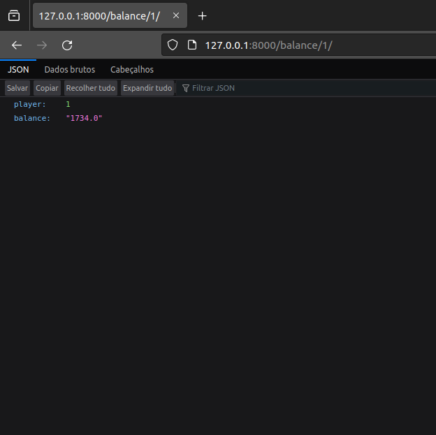
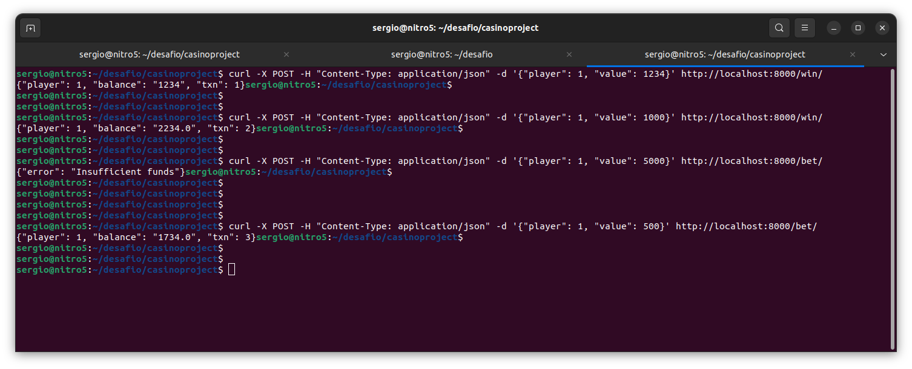

# Desafio Back-end Caleta

## Introdução sobre o desafio

Neste desafio, você representará um cassino que está integrando na nossa API. Você irá criar uma API para simular a carteira digital deste cassino, que
deverá receber transações do fluxo de jogo dos jogadores. A API deverá ser capaz de gerenciar o saldo de um jogador,
e também permitir apostas e ganhos.

### Requisitos:

As respostas da API devem ser no formato **JSON**.  
Caso containerize a aplicação, deve ser usado o **Docker**. (diferencial)

A **API** deve possuir, no mínimo, os três seguintes endpoints:

* GET /balance
* POST /bet
* POST /win

### Resultados

A construção da API foi feita atraves do Django framework.

* GET /balance 

Ao adicionar a uri indicada no desafio (`/balance/1`), é retornado um arquivo JSON, como pode ser conferido na imagem a seguir:




* POST /bet

Como só é possivel fazer requisição GET através do navegador, as requisições POST foram feitas via terminal, **/bet** com o comando:


```shell
$ curl -X POST -H "Content-Type: application/json" -d '{"player": 1, "value": 1000}' http://localhost:8000/bet/
```
como resultado, é retornado um arquivo JSON, via linha de comando e pode ser confirmado, também, pela requisição GET, onde o saldo será atualizado. Abaixo a imagem mostra o uso das duas requisições POST (bet e win).

Caso o player tente fazer uma aposta para a qual não possui saldo, ou caso seja requisitado aposta para um player que não existe, é retornado um arquivo JSON com erro e a indicação do problema.

Na imagem abaixo, temos a suposição de duas vitórias e duas apostas para o player 1, onde os valores 1234 e 1000 são adicionados a carteira, uma aposta sem saldo suficiente e a ultima aposta no valor de 500, atualizando o saldo da carteira e o número de transações



* POST /win

Da mesma forma que a requisição anterior, a requisição **/win** foi feita atraves do comando:

```shell
$ curl -X POST -H "Content-Type: application/json" -d '{"player": 1, "value": 1000}' http://localhost:8000/win/
```

#### Testes

Foram criados testes de unidade apenas para os métodos de cada endpoint com a biblioteca TestCase do python.

#### O que não foi implementado:

* Uso do Docker;
* Endpoint `/rollback`
* Uso da uri `/balance?player=1`
